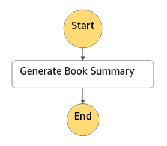
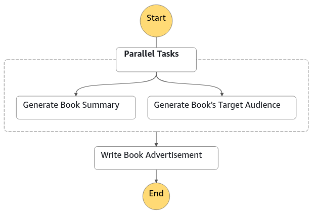
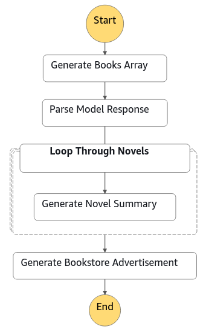
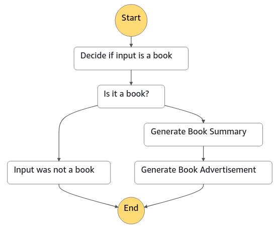
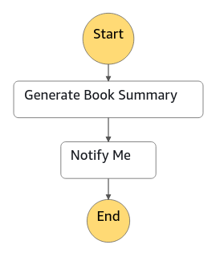
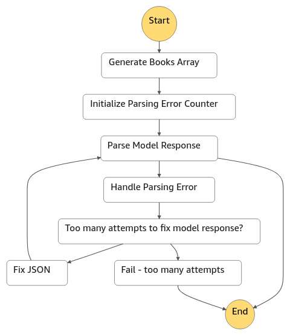
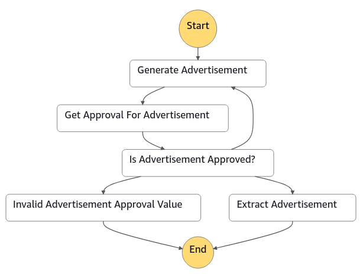

## Amazon Bedrock Serverless Prompt Chaining

This repository provides examples of how to build complex, serverless, and highly scalable
generative AI applications with prompt chaining and [Amazon Bedrock](https://aws.amazon.com/bedrock/).

[Prompt chaining](https://docs.anthropic.com/claude/docs/prompt-chaining) is a technique for
building complex generative AI applications and accomplishing complex tasks with large language models (LLMs).
With prompt chaining, you construct a set of smaller subtasks as individual prompts. Together, these subtasks
make up your overall complex task that you would like the LLM to complete for your application.
To accomplish the overall task, your application feeds each subtask prompt to the LLM in a pre-defined order or
according to a set of defined rules.

<p align="center">

</p>

This repository shows how to implement prompt chaining with either of these two AWS services,
depending on your needs and preferences:
1. **[AWS Step Functions](https://aws.amazon.com/step-functions/)**:
Step Functions can orchestrate complex workflows and invoke foundation models in Bedrock.
Beyond simple ordered chains of prompts, Step Functions state machines can contain loops, map jobs, parallel jobs,
conditions, and input/output manipulation. State machines can also chain together steps that invoke a foundation model in Bedrock,
steps that invoke custom code in AWS Lambda functions, and steps that interact with over 220 AWS services.
2. **[Amazon Bedrock Flows](https://aws.amazon.com/bedrock/flows/)**:
Bedrock Flows is purpose-built for building generative AI workflows with Bedrock.
Flows can iterate over arrays, invoke tasks in parallel, and define conditions for workflow logic.
Flows can chain together steps that invoke a model in Bedrock, invoke a Bedrock agent, and
retrieve data from a Bedrock knowledge base. Flows can also interact with S3, Lambda, and Lex.

These services (Bedrock, Bedrock Flows, and Step Functions) are all serverless,
so you don't need to manage any infrastructure to deploy and scale up your application.

<!-- toc -->

1. [Prompt chaining techniques](#prompt-chaining-techniques)
    1. [Model invocation](#model-invocation)
    1. [Prompt templating](#prompt-templating)
    1. [Sequential chains](#sequential-chains)
    1. [Parallel chains](#parallel-chains)
    1. [Map chains](#map-chains)
    1. [Conditions](#conditions)
    1. [Chain prompts and other AWS services](#chain-prompts-and-other-aws-services)
    1. [Handle failures in chains](#handle-failures-in-chains)
    1. [Wait for human input](#wait-for-human-input)
1. [Prompt chaining applications](#prompt-chaining-applications)
    1. [Write a blog post](#write-a-blog-post)
    1. [Write a story](#write-a-story)
    1. [Plan a trip](#plan-a-trip)
    1. [Pitch a movie idea](#pitch-a-movie-idea)
    1. [Plan a meal](#plan-a-meal)
    1. [Describe the most popular open source repo today](#describe-the-most-popular-open-source-repo-today)
1. [Deploy the examples](#deploy-the-examples)
1. [Security](#security)
1. [License](#license)
<!-- tocstop -->

## Prompt chaining techniques

This repository illustrate many prompt chaining techniques that can be orchestrated by Step Functions and Bedrock Flows.
The chaining techniques are described below with AWS CDK sample code snippets.
The full code can be found in the [techniques_step_functions](techniques_step_functions/)
and [techniques_bedrock_flows](techniques_bedrock_flows/) directories.

### Model invocation

Start prompt chaining by defining a static prompt, and have the chain invoke a model in Bedrock with that prompt.

<table>
<tr>
<td> Sample chain </td> <td> Sample output </td>
</tr>
<tr>
<td width="250px"></td>
<td>
Here is a one sentence summary of Pride & Prejudice by Jane Austen:

The story follows the romantic lives and relationships between the Bennet family
daughters and the eligible gentlemen of the neighborhood, most significantly the
love story between Elizabeth Bennet and Mr. Darcy that develops despite their
initial prejudices against each other.
</td>
</tr>
</table>

<details>

<summary><b>Model invocation with Step Functions</b></summary>

Step Functions can invoke models in Bedrock using the
[optimized integration for Bedrock](https://docs.aws.amazon.com/step-functions/latest/dg/connect-bedrock.html).
The `body` parameter will depend on which model is selected.

```python
from aws_cdk import (
    aws_bedrock as bedrock,
    aws_stepfunctions as sfn,
    aws_stepfunctions_tasks as tasks,
)

# Use the Step Functions integration for Bedrock
tasks.BedrockInvokeModel(
    self,
    "Generate Book Summary",
    # Choose the model to invoke
    model=bedrock.FoundationModel.from_foundation_model_id(
        self,
        "Model",
        bedrock.FoundationModelIdentifier.ANTHROPIC_CLAUDE_3_HAIKU_20240307_V1_0,
    ),
    # Provide the input to the model, including the prompt and inference properties
    body=sfn.TaskInput.from_object(
        {
            "anthropic_version": "bedrock-2023-05-31",
            "messages": [
                {
                    "role": "user",
                    "content": [
                        {
                            "type": "text",
                            # The prompt
                            "text": "Write a 1-2 sentence summary for the book Pride & Prejudice.",
                        }
                    ],
                }
            ],
            "max_tokens": 250,
            "temperature": 1,
        }
    ),
    # Extract the response from the model
    output_path="$.Body.content[0].text",
)
```

See a full example of using this technique with Step Functions [here](techniques_step_functions/stacks/model_invocation.py).
</details>

<details>

<summary><b>Model invocation with Bedrock Flows</b></summary>

Define and store the static prompt using
[Bedrock prompt management](https://aws.amazon.com/bedrock/prompt-management/).

```python
from aws_cdk import (
    aws_bedrock as bedrock,
)

# Create a prompt in Bedrock Prompt Management
generate_book_summary_prompt = bedrock.CfnPrompt(
    self,
    "GetSummaryPrompt",
    default_variant="default",
    variants=[
        bedrock.CfnPrompt.PromptVariantProperty(
            name="default",
            template_type="TEXT",
            template_configuration=bedrock.CfnPrompt.PromptTemplateConfigurationProperty(
                text=bedrock.CfnPrompt.TextPromptTemplateConfigurationProperty(
                    text="Write a 1-2 sentence summary for the book Pride & Prejudice.",
                )
            ),
            model_id=bedrock.FoundationModel.from_foundation_model_id(
                self,
                "Model",
                bedrock.FoundationModelIdentifier.ANTHROPIC_CLAUDE_3_HAIKU_20240307_V1_0,
            ),
            inference_configuration=bedrock.CfnPrompt.PromptInferenceConfigurationProperty(
                text=bedrock.CfnPrompt.PromptModelInferenceConfigurationProperty(
                    max_tokens=250,
                    temperature=1,
                )
            ),
        )
    ],
)

# Create a version of the prompt
generate_book_summary_prompt_version = bedrock.CfnPromptVersion(
    self,
    "GetSummaryPromptVersion",
    prompt_arn=generate_book_summary_prompt.attr_arn,
    # Description updates anytime the Prompt resource is updated,
    # so a new version is created when the Prompt changes
    description=f"Tracking prompt timestamp {generate_book_summary_prompt.attr_updated_at}",
)
```

Then, add a [Prompt flow node](https://docs.aws.amazon.com/bedrock/latest/userguide/flows-nodes.html#flows-nodes-data)
to the flow.

```python
generate_book_summary_node = bedrock.CfnFlow.FlowNodeProperty(
    name="Generate_Book_Summary",
    type="Prompt",
    configuration=bedrock.CfnFlow.FlowNodeConfigurationProperty(
        prompt=bedrock.CfnFlow.PromptFlowNodeConfigurationProperty(
            source_configuration=bedrock.CfnFlow.PromptFlowNodeSourceConfigurationProperty(
                resource=bedrock.CfnFlow.PromptFlowNodeResourceConfigurationProperty(
                    prompt_arn=generate_book_summary_prompt_version.attr_arn,
                )
            )
        )
    ),
    inputs=[
        bedrock.CfnFlow.FlowNodeInputProperty(
            name="input",
            type="String",
            expression="$.data",
        )
    ],
    outputs=[
        bedrock.CfnFlow.FlowNodeOutputProperty(
            name="modelCompletion",
            type="String",
        )
    ],
)
```

See a full example of using this technique with Bedrock Flows [here](techniques_bedrock_flows/stacks/model_invocation.py).
</details>

### Prompt templating

Use templated strings in your prompt chain's prompts, so you can inject values like user input.

<table>
<tr>
<td> Sample chain </td> <td> Sample input </td> <td> Sample output </td>
</tr>
<tr>
<td width="250px"></td>
<td>"Pride and Prejudice"</td>
<td>
Here is a one sentence summary of Pride and Prejudice by Jane Austen:

Pride and Prejudice follows the romantic scrapes of Elizabeth Bennet
and Fitzwilliam Darcy as they engage in a battle of wit and
misunderstandings before ultimately falling in love.
</td>
</tr>
</table>

<details>

<summary><b>Prompt templating with Step Functions</b></summary>

Prompts can be templated with Step Functions
[intrinsic functions](https://docs.aws.amazon.com/step-functions/latest/dg/amazon-states-language-intrinsic-functions.html),
Values such as the execution input or outputs from previous steps can be injected into the prompt.

```python
from aws_cdk import aws_stepfunctions as sfn

# This prompt is templated with the novel name as a variable
# from the Step Functions execution input.
# The input to the Step Functions execution could be:
# "Pride and Prejudice"
"text": sfn.JsonPath.format(
    "Write a 1-2 sentence summary for the book {}.",
    sfn.JsonPath.string_at("$$.Execution.Input"),
),
```

See a full example of using this technique with Step Functions [here](techniques_step_functions/stacks/prompt_templating.py).
</details>

<details>

<summary><b>Prompt templating with Bedrock Flows</b></summary>

With Bedrock prompt management, an input variable can be added to the stored prompt.

```python
template_configuration=bedrock.CfnPrompt.PromptTemplateConfigurationProperty(
    text=bedrock.CfnPrompt.TextPromptTemplateConfigurationProperty(
        text="Write a 1-2 sentence summary for the book {{book}}.",
        input_variables=[
            bedrock.CfnPrompt.PromptInputVariableProperty(
                name="book"
            ),
        ],
    )
)
```

The flow node can define that same input variable. When the flow is invoked, the flow node
will use the value of "book" to render the stored prompt.

```python
inputs=[
    bedrock.CfnFlow.FlowNodeInputProperty(
        name="book",
        type="String",
        expression="$.data",
    )
]
```

In the flow's connections, hook the input of the flow to the prompt node's input variable.

```python
bedrock.CfnFlow.FlowConnectionProperty(
    name="Input_Node_To_Get_Summary_Prompt_Node",
    type="Data",
    source=input_node.name,
    target=generate_book_summary_node.name,
    configuration=bedrock.CfnFlow.FlowConnectionConfigurationProperty(
        data=bedrock.CfnFlow.FlowDataConnectionConfigurationProperty(
            source_output=input_node.outputs[0].name,
            target_input=generate_book_summary_node.inputs[0].name,
        ),
    ),
)
```

See a full example of using this technique with Bedrock Flows [here](techniques_bedrock_flows/stacks/prompt_templating.py).
</details>

### Sequential chains

In a sequential chain, the model response from the first prompt in the chain
can be passed as part of the second step's prompt in the chain.
For example, the first prompt might generate a book's summary.
Then, the second prompt might use that generated book summary
as context for a second task, such as writing an advertisement for the book.

<table>
<tr>
<td> Sample chain </td> <td> Sample output </td>
</tr>
<tr>
<td width="250px"></td>
<td>
Are you looking for a classic love story with wit and social commentary? then Pride & Prejudice by Jane Austen is the novel for you. Follow Elizabeth Bennet and the landed gentlemen Mr. Darcy as they spar with their words but find their prejudices falling away to reveal a deeper affection. Austen offers a window into 19th century English society while crafting a tale as charming and compelling today as when it was first published. With her sharp insights and irresistible characters, Pride & Prejudice continues to enthrall readers after over 200 years. See beyond hasty judgments to see the truth of what really lies in the heart in this beloved work of romance and social satire.
</td>
</tr>
</table>

<details>

<summary><b>Sequential chains with Step Functions</b></summary>

Define the first prompt:

```python
"messages": [
    {
        "role": "user",
        "content": [
            {
                "type": "text",
                # The first prompt
                "text": "Write a 1-2 sentence summary for the book Pride & Prejudice.",
            }
        ],
    }
],
```

Use Step Functions intrinsic functions to inject the first prompt's output into
the second prompt's context.
```python
"messages": [
    {
        "role": "user",
        "content": [
            {
                "type": "text",
                # The previous step's prompt.
                "text": "Write a 1-2 sentence summary for the book Pride & Prejudice.",
            },
        ],
    },
    {
        # The previous step's model output
        "role": sfn.JsonPath.string_at("$.Body.role"),
        "content": sfn.JsonPath.string_at("$.Body.content"),
    },
    {
        "role": "user",
        "content": [
            {
                "type": "text",
                # The new prompt
                "text": "Now write a short advertisement for the novel.",
            },
        ],
    },
],
```

The first prompt can then be chained to a second prompt in the state machine:
```python
chain = generate_book_summary.next(generate_book_advertisement)
```

See a full example of using this technique with Step Functions [here](techniques_step_functions/stacks/sequential_chain.py).
</details>

<details>

<summary><b>Sequential chains with Bedrock Flows</b></summary>

Define the first prompt:

```python
template_configuration=bedrock.CfnPrompt.PromptTemplateConfigurationProperty(
    text=bedrock.CfnPrompt.TextPromptTemplateConfigurationProperty(
        text="Write a 1-2 sentence summary for the book Pride & Prejudice.",
    )
)
```

Inject the first prompt's output into the second prompt's context using an input variable
mamed "summary" in the second prompt.

```python
generate_book_advertisement_prompt = bedrock.CfnPrompt(
    self,
    "GetAdvertisementPrompt",
    variants=[
        bedrock.CfnPrompt.PromptVariantProperty(
            name="default",
            template_type="CHAT",
            template_configuration=bedrock.CfnPrompt.PromptTemplateConfigurationProperty(
                chat=bedrock.CfnPrompt.ChatPromptTemplateConfigurationProperty(
                    messages=[
                        bedrock.CfnPrompt.MessageProperty(
                            content=[
                                bedrock.CfnPrompt.ContentBlockProperty(
                                    text="Write a 1-2 sentence summary for the book Pride & Prejudice."
                                )
                            ],
                            role="user",
                        ),
                        bedrock.CfnPrompt.MessageProperty(
                            content=[
                                bedrock.CfnPrompt.ContentBlockProperty(
                                    text="{{summary}}"
                                ),
                            ],
                            role="assistant",
                        ),
                        bedrock.CfnPrompt.MessageProperty(
                            content=[
                                bedrock.CfnPrompt.ContentBlockProperty(
                                    text="Now write a short advertisement for the novel."
                                )
                            ],
                            role="user",
                        ),
                    ],
                    input_variables=[
                        bedrock.CfnPrompt.PromptInputVariableProperty(
                            name="summary"
                        ),
                    ],
                ),
            ),
...
```

Define the same "summary" input variable in the second prompt's flow node.

```python
inputs=[
    bedrock.CfnFlow.FlowNodeInputProperty(
        name="summary",
        type="String",
        expression="$.data",
    )
]
```

In the flow's connections, connect the output of the first prompt with input of the second prompt.

```python
bedrock.CfnFlow.FlowConnectionProperty(
    name="Get_Summary_To_Write_Advertisement",
    type="Data",
    source=generate_book_summary_node.name,
    target=generate_book_advertisement_node.name,
    configuration=bedrock.CfnFlow.FlowConnectionConfigurationProperty(
        data=bedrock.CfnFlow.FlowDataConnectionConfigurationProperty(
            source_output="modelCompletion",
            target_input="summary",
        ),
    ),
),
```

See a full example of using this technique with Bedrock Flows [here](techniques_bedrock_flows/stacks/sequential_chain.py).
</details>

### Parallel chains

Some steps in chains can be executed in parallel, with the results merged together in a later step.
For example, two prompts can run in parallel, and both model responses can be used as
context in a later prompt in the chain.

<table>
<tr>
<td> Sample chain </td> <td> Sample output </td>
</tr>
<tr>
<td width="500px"></td>
<td>
Are you a gentlewoman seeking love and excitement amid the ballrooms and country estates of Regency England?

Introducing the new novel Pride & Prejudice by Jane Austen! This captivating tale follows the lively Elizabeth Bennet and her sisters as they navigate the perils and pleasures of the marriage market.

Full of wit and social insight, Austen draws you into the world of manners and misconceptions that governs genteel society. Watch as strong-willed Lizzie clashes, then learns to see past first impressions of the handsome but haughty Mr. Darcy.

With marriage plots that entangle and hearts that misunderstand, Pride & Prejudice is a page-turning delight. It offers charming insights into love and class that women of fashion will find most diverting and relatable.

Join the Bennet sisters in their romantic adventures through balls, assemblies and country walks. With humor, feeling and social insight, Pride & Prejudice is this season's must-read for ladies seeking laughter, learning and happily-ever-after.
</td>
</tr>
</table>

<details>

<summary><b>Parallel chains with Step Functions</b></summary>

Parallel tasks can be configured as
branches of a [Parallel state](https://docs.aws.amazon.com/step-functions/latest/dg/amazon-states-language-parallel-state.html)
in the state machine.
In this example, the `generate_book_advertisement` task will receive as input a JSON object
containing the model response from the `generate_book_summary` task as the `summary` value
and the model response from the `generate_book_target_audience` task as the `audience` value.

```python
from aws_cdk import aws_stepfunctions as sfn

chain = (
    sfn.Parallel(
        self,
        "Parallel Tasks",
        result_selector={
            "summary.$": "$[0]",
            "audience.$": "$[1]",
        },
    )
    .branch(generate_book_summary)
    .branch(generate_book_target_audience)
).next(generate_book_advertisement)
```

See a full example of using this technique with Step Functions [here](techniques_step_functions/stacks/parallel_chain.py).
</details>

<details>

<summary><b>Parallel chains with Bedrock Flows</b></summary>

Parallel tasks can be configured by connecting the same input to two different nodes in the flow.
Then, the output of those two nodes are both connected to a single node.
In this example, the flow's input connects to both the `generate_book_summary` node and the
`generate_book_summary` node, which run in parallel.
The `generate_book_advertisement` node's input variables are
`summary` (value provided by the output of the `generate_book_summary` node) and
`audience` (value provided by the output of the `generate_book_target_audience` node).

```python
[
    # Input -> Get Summary
    bedrock.CfnFlow.FlowConnectionProperty(
        name="_".join([input_node.name, generate_book_summary_node.name]),
        type="Data",
        source=input_node.name,
        target=generate_book_summary_node.name,
        configuration=bedrock.CfnFlow.FlowConnectionConfigurationProperty(
            data=bedrock.CfnFlow.FlowDataConnectionConfigurationProperty(
                source_output="document",
                target_input="book",
            ),
        ),
    ),
    # Input -> Get Target Audience
    bedrock.CfnFlow.FlowConnectionProperty(
        name="_".join([input_node.name, generate_book_target_audience_node.name]),
        type="Data",
        source=input_node.name,
        target=generate_book_target_audience_node.name,
        configuration=bedrock.CfnFlow.FlowConnectionConfigurationProperty(
            data=bedrock.CfnFlow.FlowDataConnectionConfigurationProperty(
                source_output="document",
                target_input="book",
            ),
        ),
    ),
    # Get Summary -> Write an Advertisement
    bedrock.CfnFlow.FlowConnectionProperty(
        name="_".join(
            [generate_book_summary_node.name, generate_book_advertisement_node.name]
        ),
        type="Data",
        source=generate_book_summary_node.name,
        target=generate_book_advertisement_node.name,
        configuration=bedrock.CfnFlow.FlowConnectionConfigurationProperty(
            data=bedrock.CfnFlow.FlowDataConnectionConfigurationProperty(
                source_output="modelCompletion",
                target_input="summary",
            ),
        ),
    ),
    # Get Target Audience -> Write an Advertisement
    bedrock.CfnFlow.FlowConnectionProperty(
        name="_".join(
            [generate_book_target_audience_node.name, generate_book_advertisement_node.name]
        ),
        type="Data",
        source=generate_book_target_audience_node.name,
        target=generate_book_advertisement_node.name,
        configuration=bedrock.CfnFlow.FlowConnectionConfigurationProperty(
            data=bedrock.CfnFlow.FlowDataConnectionConfigurationProperty(
                source_output="modelCompletion",
                target_input="audience",
            ),
        ),
    ),
    # Write an Advertisement -> Output
    bedrock.CfnFlow.FlowConnectionProperty(
        name="_".join([generate_book_advertisement_node.name, output_node.name]),
        type="Data",
        source=generate_book_advertisement_node.name,
        target=output_node.name,
        configuration=bedrock.CfnFlow.FlowConnectionConfigurationProperty(
            data=bedrock.CfnFlow.FlowDataConnectionConfigurationProperty(
                source_output="modelCompletion",
                target_input="document",
            ),
        ),
    ),
]
```

See a full example of using this technique with Bedrock Flows [here](techniques_bedrock_flows/stacks/parallel_chain.py).
</details>

### Map chains

Map chains iterate over a collection of inputs, processing each one and creating a new output for each item
into a new list, similar to Python's map function.
In a map chain, an array of items can be generated by a model through a prompt, or through some other means.
Then, each item in the array can be injected into another prompt, one at a time, to generate another array of
model responses. Finally, the array can be merged into a single prompt as additional context.

In this example, the model first generates a list of books, which can be parsed into a JSON array.
For each book in the array, a summary of that book is generated. Finally, the list of generated book
summaries is fed into a prompt that generates an advertisement for a bookstore.

<table>
<tr>
<td> Sample chain </td> <td> Sample output </td>
</tr>
<tr>
<td width="275px"></td>
<td>
Come discover stories of romance, intrigue, and social commentary at Acme Books! Immerse yourself in the lavish yet turbulent 1920s with The Great Gatsby. Uncover truths about love and class in Pride and Prejudice. Question government and humanity in 1984. Experience the injustice of racial tensions through a child's eyes in To Kill a Mockingbird. And journey into the disillusionment of adolescence with The Catcher in the Rye. We have these classic novels and more - come browse our expansive selection today!
</td>
</tr>
</table>

<details>

<summary><b>Map chains in Step Functions</b></summary>

[Map states](https://docs.aws.amazon.com/step-functions/latest/dg/amazon-states-language-map-state.html)
iterate over a collection of inputs, processing each one and creating a new output for each item.
The `generate_bookstore_advertisement` task in the state machine below will receive an array of `generate_book_summary`
outputs as its input.

```python
chain = (
    generate_books_list.next(convert_model_response_to_array)
    .next(
        sfn.Map(
            self,
            "Loop Through Novels",
            items_path=sfn.JsonPath.string_at("$.novels"),
            parameters={
                "novel.$": "$$.Map.Item.Value",
            },
            max_concurrency=1,
        ).iterator(generate_book_summary)
    )
    .next(generate_bookstore_advertisement)
)
```

See a full example of using this technique with Step Functions [here](techniques_step_functions/stacks/map_chain.py).
</details>

<details>

<summary><b>Map chains in Bedrock Flows</b></summary>

Map chains are implemented in Bedrock Flows using
[an Iterator node and a Collector node](https://docs.aws.amazon.com/bedrock/latest/userguide/flows-nodes.html#flows-nodes-logic).
The Iterator node takes an array as input, and sends each array item through
the nodes that are between the Iterator node and the Collector node in the flow.
The Collector node receives a new array containing the output of each array item.

In this flow's connections, the Iterator node connects to a Prompt node that
generates a book summary for each book in the array.
The Prompt node connects to a Collector node
to collect the list of generated book summaries.

```python
# Books Iterator -> Get Summary
bedrock.CfnFlow.FlowConnectionProperty(
    name="Iterator_To_Get_Summary",
    type="Data",
    source=books_iterator_node.name,
    target=generate_book_summary_node.name,
    configuration=bedrock.CfnFlow.FlowConnectionConfigurationProperty(
        data=bedrock.CfnFlow.FlowDataConnectionConfigurationProperty(
            source_output="arrayItem",
            target_input="book",
        ),
    ),
),
# Get Summary -> Books Collector
bedrock.CfnFlow.FlowConnectionProperty(
    name="Get_Summary_To_Iterator",
    type="Data",
    source=generate_book_summary_node.name,
    target=books_collector_node.name,
    configuration=bedrock.CfnFlow.FlowConnectionConfigurationProperty(
        data=bedrock.CfnFlow.FlowDataConnectionConfigurationProperty(
            source_output="modelCompletion",
            target_input="arrayItem",
        ),
    ),
),
```

See a full example of using this technique with Bedrock Flows [here](techniques_bedrock_flows/stacks/map_chain.py).
</details>

### Conditions

Model responses can influence the logic of a prompt chain with conditions.
The model response can be compared to some other value, such as string equality or number comparisons,
in order to determine which step in the workflow to invoke next.

In this example, the model is asked to validate whether the user's input is indeed a book,
before generating a summary for it. The prompt instructs the model to answer "yes" or "no".
If model's response is "yes", the chain will invoke the prompt that generates
the book summary. If the model's response is "no", the chain will enter a failure state
because of the invalid input.

<table>
<tr>
<td> Sample chain </td> <td> Sample input </td> <td> Sample output </td>
</tr>
<tr>
<td width="450px"></td>
<td>"Pride and Prejudice"</td>
<td>
Here is a short 4 line advertisement for Pride & Prejudice:

Jane Austen's beloved classic tale of romance and wit.

Follow Elizabeth Bennet as her prejudice against the wealthy Mr. Darcy leads to humorous misunderstandings. Will pride and class division keep them apart or will their feelings overcome society's expectations?

Immerse yourself in Regency-era England through Austen's timeless characters and sharp social commentary in this beloved story of love triumphing over judgment.
</td>
</tr>
</table>

<details>

<summary><b>Conditions with Step Functions</b></summary>

Conditions can be implemented using a
[Choice state](https://docs.aws.amazon.com/step-functions/latest/dg/amazon-states-language-choice-state.html).

```python
from aws_cdk import aws_stepfunctions as sfn

# Decide which state to transition to next, based on the model's response
is_book_decision = (
    sfn.Choice(self, "Is it a book?")
    .when(
        sfn.Condition.string_equals("$.Body.content[0].text", "yes"),
        generate_book_summary.next(generate_book_advertisement),
    )
    .otherwise(sfn.Fail(self, "Input was not a book"))
)

# Prompt the model to determine whether the input is a book first
chain = generate_is_book_response.next(is_book_decision)
```

See a full example of using this technique with Step Functions [here](techniques_step_functions/stacks/conditional_chain.py).
</details>

<details>

<summary><b>Conditions with Bedrock Flows</b></summary>

Conditions can be implemented using a
[Condition node](https://docs.aws.amazon.com/bedrock/latest/userguide/flows-nodes.html#flows-nodes-logic).

In the example below, the result of the condition will be "yes" if the model validated that the
input is a book.  Otherwise, the result will be "default".

```python
validate_input_condition_node = bedrock.CfnFlow.FlowNodeProperty(
    name="Validate_Input_Condition",
    type="Condition",
    configuration=bedrock.CfnFlow.FlowNodeConfigurationProperty(
        condition=bedrock.CfnFlow.ConditionFlowNodeConfigurationProperty(
            conditions=[
                bedrock.CfnFlow.FlowConditionProperty(
                    name="yes", expression='validationResult == "yes"'
                ),
                bedrock.CfnFlow.FlowConditionProperty(name="default"),
            ]
        )
    ),
    inputs=[
        bedrock.CfnFlow.FlowNodeInputProperty(
            name="validationResult",
            type="String",
            expression="$.data",
        )
    ],
)
```

In the flow's connections, connect the "yes" condition result to the `generate_book_summary`
node.  Connect the "default" condition result to an output that indicates input validation failure.

```python
# Validate Input Condition -> Invalid Input
bedrock.CfnFlow.FlowConnectionProperty(
    name="Input_Condition_To_Invalid_Input",
    type="Conditional",
    source=validate_input_condition_node.name,
    target=invalid_input_node.name,
    configuration=bedrock.CfnFlow.FlowConnectionConfigurationProperty(
        conditional=bedrock.CfnFlow.FlowConditionalConnectionConfigurationProperty(
            condition="default"
        )
    ),
),
# Validate Input Condition -> Get Summary
bedrock.CfnFlow.FlowConnectionProperty(
    name="Input_Condition_To_Generate_Book_Summary",
    type="Conditional",
    source=validate_input_condition_node.name,
    target=generate_book_summary_node.name,
    configuration=bedrock.CfnFlow.FlowConnectionConfigurationProperty(
        conditional=bedrock.CfnFlow.FlowConditionalConnectionConfigurationProperty(
            condition="yes"
        )
    ),
),
```

See a full example of using this technique with Bedrock Flows [here](techniques_bedrock_flows/stacks/conditional_chain.py).
</details>

### Chain prompts and other AWS services

Chaining prompts with calls to AWS services in a single chain makes it possible
to build more capable generative AI applications.
For example, you can add custom code to the chain by adding a Lambda function
to the workflow.
You can also retrieve additional context for a prompt from any AWS storage or
database service, such as Bedrock knowledge bases, S3, or DynamoDB, as part of the chain.
Or, a model's response can be sent on to other AWS services like SNS
or SQS in the chain.

In this example, the model's response is sent as a message to an SNS topic.
<table>
<tr>
<td> Sample chain </td> <td> Sample input </td> <td> Sample SNS topic message </td>
</tr>
<tr>
<td width="250px"></td>
<td>"Pride and Prejudice"</td>
<td>
"summary": "Here is a one sentence summary of Pride and Prejudice by Jane Austen:\nIt follows the romance between Elizabeth Bennet, the clever second daughter of a gentleman farmer, and Fitzwilliam Darcy, a wealthy aristocrat, as prejudices arising from their social differences are overcome through their developing affection and respect for each other."
</br> </br>
"book": "Pride and Prejudice"
</td>
</tr>
</table>

<details>

<summary><b>AWS service chains with Step Functions</b></summary>

Step Functions supports calling
[over 220 AWS services](https://docs.aws.amazon.com/step-functions/latest/dg/integrate-services.html)
from a state machine, which can be chained with steps that invoke a model in Bedrock.
This example uses Step Function's support for publishing a message to SNS
directly from the state machine.

```python
from aws_cdk import (
    aws_sns as sns,
    aws_stepfunctions as sfn,
    aws_stepfunctions_tasks as tasks,
)

topic = sns.Topic(
    self, "Topic", display_name="Notifications about generated book summaries"
)
notify_me = tasks.SnsPublish(
    self,
    "Notify Me",
    topic=topic,
    message=sfn.TaskInput.from_object(
        {
            # Retrieve the model's response from the previous task
            "summary": sfn.TaskInput.from_json_path_at(
                "$.Body.content[0].text"
            ),
            # Retrieve the book name from the execution input
            "book": sfn.TaskInput.from_json_path_at("$$.Execution.Input"),
        }
    ),
    result_path=sfn.JsonPath.DISCARD,
)

# Generate the book summary, then send the notification
chain = generate_book_summary.next(notify_me)
```

See a full example of using this technique with Step Functions [here](techniques_step_functions/stacks/aws_service_invocation.py).
</details>

<details>

<summary><b>AWS service chains with Bedrock Flows</b></summary>

Bedrock Flows supports a limited number of
[direct AWS service integrations](https://docs.aws.amazon.com/bedrock/latest/userguide/flows-nodes.html#flows-nodes-data),
including Bedrock agents, Bedrock knowledge bases, S3, Lambda, and Lex.
To add other AWS services to a flow, you will need to write a Lambda function
that calls the AWS service API you need.
Then, add a Lambda function node to the flow to invoke that function.

```python
bedrock.CfnFlow.FlowNodeProperty(
    name="Publish_To_Sns_Topic",
    type="LambdaFunction",
    configuration=bedrock.CfnFlow.FlowNodeConfigurationProperty(
        lambda_function=bedrock.CfnFlow.LambdaFunctionFlowNodeConfigurationProperty(
            lambda_arn=sns_publish_message_lambda.function_arn,
        ),
    ),
    inputs=[
        bedrock.CfnFlow.FlowNodeInputProperty(
            name="input",
            type="String",
            expression="$.data",
        )
    ],
    outputs=[
        bedrock.CfnFlow.FlowNodeOutputProperty(
            name="functionResponse",
            type="String",
        )
    ],
)
```

The Bedrock Flows condition example [here](techniques_bedrock_flows/stacks/conditional_chain.py)
contains an example of invoking a Lambda function as part of a flow.
</details>

### Handle failures in chains

When a particular format is required for the model response (such as JSON array),
the model may occasionally fail to comply with all instructions about the desired format.
To improve the likelihood of success, the model can be re-prompted to fix its own
response to comply with the desired format.

In this example, if parsing the model response against a JSON schema fails,
then the model is prompted to fix the response to comply with the schema.
If the model cannot fix the JSON within three attempts, the workflow fails.

<table>
<tr>
<td> Sample chain </td> <td> Sample output </td>
</tr>
<tr>
<td width="390px"></td>
<td>

```json
{
  "novels": [
    {
      "title": "Pride and Prejudice",
      "author": "Jane Austen"
    },
    {
      "title": "The Great Gatsby",
      "author": "F. Scott Fitzgerald"
    },
    {
      "title": "To Kill a Mockingbird",
      "author": "Harper Lee"
    },
    {
      "title": "1984",
      "author": "George Orwell"
    },
    {
      "title": "The Lord of the Rings",
      "author": "J.R.R. Tolkien"
    }
  ]
}
```
</td>
</tr>
</table>

<details>

<summary><b>Failure handling chains with Step Functions</b></summary>

You can use [Catch fields](https://docs.aws.amazon.com/step-functions/latest/dg/concepts-error-handling.html#error-handling-handling-failure-using-catch)
to handle failures of individual tasks in the state machine.

In this example, the model response is validated against a strict JSON schema, using
custom code in a Lambda function. If the JSON validation throws an exception, the error
is caught by the state machine and it transitions to a task that prompts the model
to fix the JSON validation error. If the fixed output passes JSON validation, the
execution succeeds. If not, the model is prompted against to fix its response.
To prevent an infinite loop, a counter is incremented each time the model is prompted
to fix the response. The execution fails if the counter passes a threshold.

```python
from aws_cdk import aws_stepfunctions as sfn

# Only try to fix the JSON a few times, then give up and fail
attempt_to_fix_json = handle_parsing_error.next(
    sfn.Choice(self, "Too many attempts to fix model response?")
    .when(
        sfn.Condition.number_less_than("$.error_state.parse_error_count", 3),
        fix_json.next(parse_model_response),
    )
    .otherwise(sfn.Fail(self, "Fail - too many attempts"))
)

# If the JSON validation throws an exception, catch it and re-prompt the model
parse_model_response.add_catch(
    handler=attempt_to_fix_json,
    errors=[sfn.Errors.TASKS_FAILED],
    result_path="$.caught_error",
)

chain = generate_books_list.next(initialize_parse_attempt_counter).next(
    parse_model_response
)
```

See a full example of using this technique with Step Functions [here](techniques_step_functions/stacks/validation_chain.py).
</details>

<details>

<summary><b>Failure handling chains with Bedrock Flows</b></summary>

Compared to the Step Functions solution,
Bedrock Flows does not support catching errors in the flow.
For example, if a Lambda function that validates the model's response
throws an exception on failure to parse, the flow will fail.
Your function would need to return a special response for parsing failure,
which can be handled by a Condition node (see the Condition section).
</details>

### Wait for human input

In some cases, a complex generative AI task requires human input before continuing to
further steps in that complex workflow.
In this example, the human is asked to approve a generated advertisement, with the decision
of "yes" or "no". If the generated ad is not approved by the human,
the model will be invoked again to generate a new ad,
requiring human input again to approve the new ad.

<table>
<tr>
<td> Sample chain </td> <td> Sample input </td> <td> Sample output </td>
</tr>
<tr>
<td width="495px"></td>
<td>"Pride and Prejudice"</td>
<td>
Here is a draft 150-word advertisement for Pride and Prejudice by Jane Austen:

Tales of love, manners, and misunderstanding in Regency-era England
<br/><br/>
Pride and prejudice collide in Jane Austen's beloved romantic classic. Follow the spirited Elizabeth Bennet and her sisters as they navigate the balls and social events of 19th century British high society in their pursuit of marriage and love. Full of wit, Mrs. Bennet's constant efforts to marry off her daughters provide much comic relief. But at the center is the pride of Mr. Darcy and Elizabeth's prejudice against him, as both struggle against their initial impressions and find their feelings growing deeper. Austen crafts a timeless story of the challenges for women and men seeking partners, and the obstacles of class and social pressures. Immerse yourself in Austen's rich comedy of manners, keen social commentary, and the development of one of literature's most romantic couples. Join the Bennet family in their memorable adventures in this prose gem that has charmed readers for over 200 years.
</td>
</tr>
</table>

<details>

<summary><b>Human input chains with Step Functions</b></summary>

Step Functions supports asynchronous processing
during state machine executions through
[callbacks with a task token](https://docs.aws.amazon.com/step-functions/latest/dg/connect-to-resource.html#connect-wait-token).
Where human input is required, the state machine can send a task token to some system
that will notify a human that their input is required. When the human has provided their
input, the system should send the input value and the task token value to Step Functions,
so that the state machine execution can continue.

In this example, the task token is sent in a message to an SNS topic
when human input is required in the state machine.

```python
topic = sns.Topic(
    self, "Topic", display_name="Advertisements that need approval"
)
publish_ad_for_approval = tasks.SnsPublish(
    self,
    "Get Approval For Advertisement",
    topic=topic,
    integration_pattern=sfn.IntegrationPattern.WAIT_FOR_TASK_TOKEN,
    message=sfn.TaskInput.from_object(
        {
            "advertisement": sfn.JsonPath.string_at("$.Body.content[0].text"),
            "task_token": sfn.JsonPath.task_token,
        }
    ),
    result_path="$.human_input",
)
```

A Choice state determines the next state based on the response from the human.

```python
handle_user_decision = (
    sfn.Choice(self, "Is Advertisement Approved?")
    .when(
        # Human approved the ad - finish the Step Functions execution
        sfn.Condition.string_equals("$.human_input.decision", "yes"),
        extract_ad,
    )
    .when(
        # Human rejected the ad - loop back to generate a new ad
        sfn.Condition.string_equals("$.human_input.decision", "no"),
        generate_advertisement,
    )
    .otherwise(
        sfn.Fail(
            self,
            "Invalid Advertisement Approval Value",
            cause="Unknown user choice (decision must be yes or no)",
            error="Unknown user choice (decision must be yes or no)",
        )
    )
)

chain = generate_advertisement.next(publish_ad_for_approval).next(
    handle_user_decision
)
```

See a full example of using this technique with Step Functions [here](techniques_step_functions/stacks/human_input_chain.py).
</details>

<details>

<summary><b>Human input chains with Bedrock Flows</b></summary>

Compared to the Step Functions solution,
Bedrock Flows does not support pausing the flow to wait for human input.
You would need to orchestrate custom logic outside of Bedrock Flows
that waits for human input and invokes a new flow when human input is available.
</details>

## Prompt chaining applications

This repository contains several working examples of using the prompt chaining techniques described above,
as part of a demo generative AI application that uses Step Functions for prompt chaining.
The [Streamlit-based](https://streamlit.io/) demo application
executes each example's Step Functions state machine and displays the results,
including the content generated by foundation models in Bedrock.
The Step Functions state machines are defined using [AWS CDK](https://aws.amazon.com/cdk/) in Python.


### Write a blog post

This example generates an analysis of a given novel for a literature blog.


This task is broken down into multiple subtasks to first generate individual paragraphs
focused on specific areas of analysis, then a final subtask to pull together the generated
content into a single blog post. The workflow is a simple, sequential chain of prompts.
The previous prompts and LLM responses are carried forward as context and included in
the next prompt as context for the next step in the chain.


CDK code: [stacks/blog_post_stack.py](stacks/blog_post_stack.py)

### Write a story

This example generates a short story about a given topic.


This task is broken down into multiple subtasks to first generate a list of characters for the story,
generate each character's arc for the story, and then finally generate the short story using
the character descriptions and arcs. This example illustrates using a loop in a Step Functions
state machine to process a list generated by a foundation model in Bedrock, in this case to process
the generated list of characters.


CDK code: [stacks/story_writer_stack.py](stacks/story_writer_stack.py)

### Plan a trip

This example generates an itinerary for a weekend vacation to a given destination.


This task is broken down into multiple subtasks, which first generate suggestions for hotels,
activities, and restaurants and then combines that content into a single daily itinerary.
This example illustrates the ability to parallelize multiple distinct prompts in a Step Functions
state machine, in this case to generate the hotel, activity, and restaurant recommendations in
parallel.
This example also illustrates the ability to chain together prompts and custom code.
The final step in the state machine is a Lambda function that creates a PDF of the itinerary
and uploads it to S3, with no generative AI interactions.


CDK code: [stacks/trip_planner_stack.py](stacks/trip_planner_stack.py)

### Pitch a movie idea

This example acts as an AI screenwriter pitching movie ideas to the human user acting as a movie producer.
The movie producer can greenlight the AI's movie idea to get a longer one-page pitch for the idea,
or they can reject the movie idea and the AI will generate a new idea to pitch.


This task is broken down into multiple subtasks: first, the prompt for generating a movie idea is invoked
multiple times in parallel with three different
[temperature settings](https://docs.aws.amazon.com/bedrock/latest/userguide/model-parameters.html#text-playground-adjust-random)
to generate three possible ideas. The next prompt in the chain chooses the best idea to pitch to the movie producer.
The chain pauses while waiting for human input from the movie producer, either "greenlight" or "pass".
If the movie producer greenlights the idea, the final prompt in the chain will generate a longer pitch using
the chosen movie idea as context. If not, the chain loops back to the beginning of the chain, and generates three new ideas.

This example illustrates the ability to parallelize the same prompt with different inference parameters,
to have multiple possible paths in the chain based on conditions, and to backtrack to a previous step in the chain.
This example also illustrates the ability to require human user input as part of the workflow, using a Step Functions
[task token](https://docs.aws.amazon.com/step-functions/latest/dg/connect-to-resource.html#connect-wait-token)
to wait for a callback containing the human user's decision.


CDK code: [stacks/movie_pitch_stack.py](stacks/movie_pitch_stack.py)

### Plan a meal

This example generates a recipe for the user, based on a few given ingredients they have on hand.


This task is broken down into multiple subtasks: first, two possible meal ideas are generated in parallel, with
the two prompts acting as two different "AI chefs". The next prompt in the chain scores the two meal suggestions
on a scale of 0 to 100 for "tastiness" of each described meal.
The AI chefs receive the scores for both meal suggestions, and attempt to improve their own score in comparison
to the other chef by making another meal suggestion.
Another prompt determines whether the chefs have reached a consensus and suggested the same meal. If not,
the chain loops back to generate new scores and new meal suggestions from the chefs.
A small Lambda function with no LLM interaction chooses the highest-scoring meal,
and the final prompt in the chain generates a recipe for the winning meal.

This example illustrates how prompt chains can incorporate two distinct AI conversations, and have
two AI personas engage in a ["society of minds"](https://arxiv.org/abs/2305.14325) debate with each other
to improve the final outcome.
This example also illustrates the ability to chain together prompts and custom code, in this case
choosing the highest meal score.


CDK code: [stacks/meal_planner_stack.py](stacks/meal_planner_stack.py)

### Describe the most popular open source repo today

This example summarizes the open source repository that is the highest trending repository on GitHub today.


This task is broken down into multiple subtasks to first determine which open source repository
is the highest trending on GitHub today (based on the [GitHub Trending](https://github.com/trending) page),
and then generate a summary of the repository based on its README file.
This example illustrates chaining two [ReAct prompts](https://www.promptingguide.ai/techniques/react) (also known as ReAct agents)
together in a two-step sequential pipeline to answer the question 'What is the top trending repository on GitHub today?'.
The two ReAct agents each interact with GitHub APIs to get current information; otherwise, they would not
be able to identify the current trending repository or its current purpose.
The first agent scrapes the [GitHub Trending](https://github.com/trending) page, and the second agent calls the GitHub API
for [retrieving a repository README](https://docs.github.com/en/rest/repos/contents?apiVersion=2022-11-28#get-a-repository-readme).

Note that this particular example does not require chaining - it could be implemented as a single agent.
LLMs are capable of reasoning about and answering this relatively simple question in a single ReAct agent, by calling
multiple GitHub APIs within the same agent. This example is simply meant to illustrate how a complex task
requiring ReAct prompting can be broken down into multiple chained subtasks.


This example is implemented in two different versions,
one uses [Bedrock Agents](https://aws.amazon.com/bedrock/agents/)
and the other uses [Langchain agents](https://python.langchain.com/docs/modules/agents/agent_types/react).

CDK code for Bedrock Agents version: [stacks/most_popular_repo_bedrock_agent_stack.py](stacks/most_popular_repo_bedrock_agent_stack.py)

Note that Bedrock Agents does not yet support CloudFormation. The CDK stack creates all other resources required by the agent, but the agent itself must be created manually. Instructions for manually creating the agent in Bedrock Agents are [here](DEVELOP.md).

CDK code for Langchain version: [stacks/most_popular_repo_langchain_stack.py](stacks/most_popular_repo_langchain_stack.py)

## Deploy the examples

See the [development guide](DEVELOP.md) for instructions on how to deploy the demo application and the technique examples.

## Security

See [CONTRIBUTING](CONTRIBUTING.md#security-issue-notifications) for more information.

## License

This library is licensed under the MIT-0 License. See the LICENSE file.
